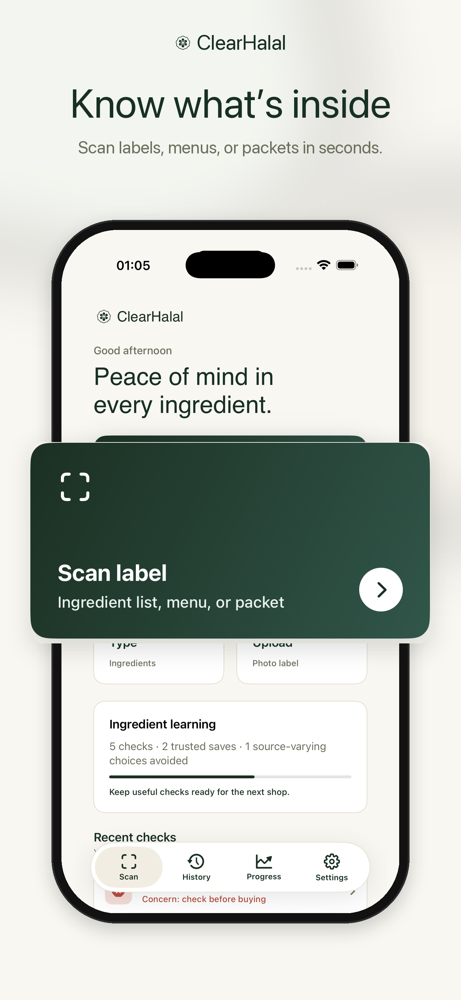
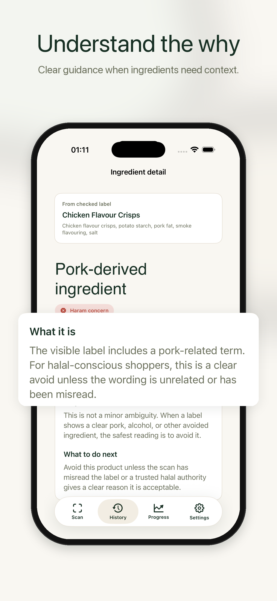

# ClearHalal

**A native iOS food-label companion that explains halal ingredient concerns instead of returning a black-box score.**

[Try the interactive web demo](https://u-kaushik.github.io/clearhalal/) · [Explore the SwiftUI source](app/) · [View the product flow](#product-preview)



## Why I built it

Ingredient labels are difficult to interpret: additives can have plant or animal sources, certifications vary, and a simple yes/no answer can hide important uncertainty. ClearHalal makes the reasoning visible and gives the user a practical next step.

## Product preview

| Scan | Explain | Decide |
| --- | --- | --- |
| Capture or paste an ingredient list | Highlight the exact terms that matter | Return a green, orange, or red outcome with cautious language |

The [browser demo](https://u-kaushik.github.io/clearhalal/) is intentionally deterministic so anyone can explore all three states without camera access:

- **Green — Likely halal:** no commonly flagged terms in the visible text.
- **Orange — Uncertain:** gelatin, E471, or flavourings require source confirmation.
- **Red — Avoid:** an explicitly pork-derived ingredient is present.



## Engineering highlights

- SwiftUI architecture with reusable views, typed domain models, and lightweight local persistence.
- Vision-based on-device text recognition; label images do not need to leave the device.
- Explainable, deterministic classification that maps evidence to user-facing next steps.
- StoreKit configuration and RevenueCat integration points for subscriptions.
- Accessible visual hierarchy and explicit uncertainty states rather than false precision.
- A zero-dependency HTML/CSS/JavaScript demo deployed with GitHub Pages.

## Run the iOS app

Requirements: Xcode 16+, iOS 17+.

1. Open `app/ClearHalal.xcodeproj`.
2. Select the `ClearHalal` scheme and an iPhone simulator.
3. Build and run.

The project uses Swift Package Manager. A placeholder RevenueCat configuration keeps the UI explorable without production subscription credentials.

## Architecture

```text
SwiftUI views → ScanHistoryStore → LabelTextRecognizer (Vision)
                              ↘ HalalClassifier → verdict + evidence + next step
```

Key code: [`HalalClassifier.swift`](app/Services/HalalClassifier.swift), [`LabelTextRecognizer.swift`](app/Services/LabelTextRecognizer.swift), and [`ResultView.swift`](app/Views/ResultView.swift).

## Scope and responsible use

ClearHalal is a portfolio project and decision-support tool. It does not replace certification bodies, manufacturers, or qualified religious guidance. Results only reflect text visible in the supplied label.

## License

Source is available for portfolio review. All rights reserved unless stated otherwise.
