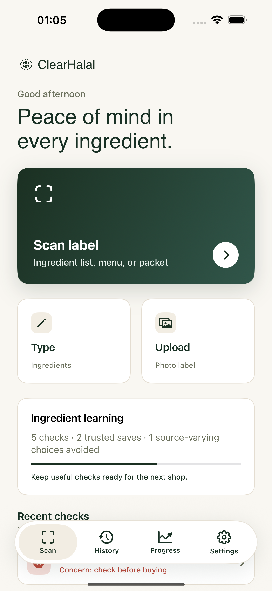
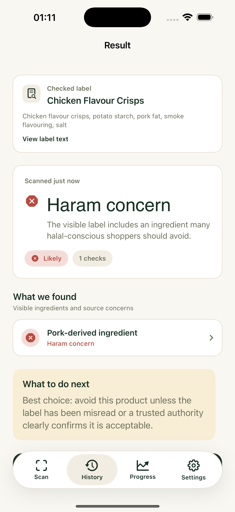

# ClearHalal

**An end-to-end iOS product engagement for Glenmont Circle: a food-label companion that explains halal ingredient concerns instead of returning a black-box score.**

[Try the interactive web demo](https://u-kaushik.github.io/clearhalal/) · [Explore the SwiftUI source](app/) · [View the product flow](#product-preview)



## Project context

Glenmont Circle commissioned ClearHalal from an initial product brief through App Store submission. I worked as the independent product designer and iOS engineer responsible for the complete delivery: product definition, UX and visual identity, interaction design, SwiftUI implementation, on-device scanning, monetisation integration, launch assets, and supporting web experience.

The brief addressed a difficult product-design problem: additives can have plant or animal sources, certifications vary, and a simple yes/no answer can hide important uncertainty. My approach made the reasoning visible and gave users a practical next step without presenting the app as a certification authority.

## My contribution

- Took the studio brief from early product definition to a submitted iOS application.
- Designed the brand system, information architecture, onboarding, scanning flow, result states, history, progress, settings, and subscription experience.
- Built the native SwiftUI application and its Vision-based, on-device label-recognition flow.
- Developed the explainable classification model and cautious green, orange, and red decision language.
- Produced the App Store presentation, product website, interactive portfolio demo, and release documentation.

## Product preview

| Scan | Explain | Decide |
| --- | --- | --- |
| Capture or paste an ingredient list | Highlight the exact terms that matter | Return a green, orange, or red outcome with cautious language |

The [browser demo](https://u-kaushik.github.io/clearhalal/) is intentionally deterministic so anyone can explore all three states without camera access:

- **Green — Likely halal:** no commonly flagged terms in the visible text.
- **Orange — Uncertain:** gelatin, E471, or flavourings require source confirmation.
- **Red — Avoid:** an explicitly pork-derived ingredient is present.



## Engineering highlights

- SwiftUI architecture with reusable views, typed domain models, and lightweight local persistence.
- Vision-based on-device text recognition; label images do not need to leave the device.
- Explainable, deterministic classification that maps evidence to user-facing next steps.
- StoreKit configuration and RevenueCat integration points for subscriptions.
- Accessible visual hierarchy and explicit uncertainty states rather than false precision.
- A zero-dependency HTML/CSS/JavaScript demo deployed with GitHub Pages.

## Run the iOS app

Requirements: Xcode 16+, iOS 17+.

1. Open `app/ClearHalal.xcodeproj`.
2. Select the `ClearHalal` scheme and an iPhone simulator.
3. Build and run.

The project uses Swift Package Manager. A placeholder RevenueCat configuration keeps the UI explorable without production subscription credentials.

## Architecture

```text
SwiftUI views → ScanHistoryStore → LabelTextRecognizer (Vision)
                              ↘ HalalClassifier → verdict + evidence + next step
```

Key code: [`HalalClassifier.swift`](app/Services/HalalClassifier.swift), [`LabelTextRecognizer.swift`](app/Services/LabelTextRecognizer.swift), and [`ResultView.swift`](app/Views/ResultView.swift).

## Scope and responsible use

This repository is a portfolio presentation of work delivered for Glenmont Circle. ClearHalal is a decision-support tool; it does not replace certification bodies, manufacturers, or qualified religious guidance. Results only reflect text visible in the supplied label.

## License

Source is available for portfolio review. All rights reserved unless stated otherwise.
